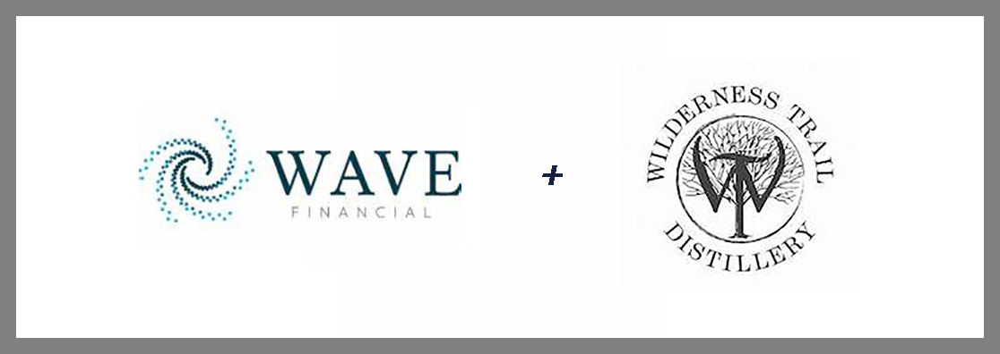

# Investment Fund Tokenizes Bourbon

## Wave Financial partners with Wilderness Trail Distillery to launch a digital asset fund backed by bourbon.

[Wave Financial LLC](https://www.wavegp.com/) (Wave) established the Wave Kentucky Whiskey 2020 Digital Asset Fund, LLC (Fund) to create a unique investment vehicle for their clients. Wave was established in Delaware in 2018, although it is currently registered and operating out of Los Angeles, California. The company employees five investment advisors and four support staff.
  

### Primary Stakeholders

[**David Siemer**](https://www.linkedin.com/in/davidsiemer/) is Wave’s Founder and Chief Executive Officer. Before starting the company, he co-founded and currently manages Wavemaker Genesis and Wavemaker Partners. Both are firms that invest in early stage crypto and enterprise technology. 

[**Benjamin Tsai**](https://www.linkedin.com/in/benjamin-tsai-investor/) is Wave’s President and Managing Partner. He manages the Fund and has over 15 years of investment management and technology development experience. He co-founded LA Blockchain Lab in 2018 and is its current CFO.

[**Matteo Dante Perruccio**](https://www.linkedin.com/in/matteo-dante-perruccio-43575b11/?originalSubdomain=uk) is a partner at Wave and President of the company’s international division. He was instrumental in the formation and launch of the Fund. Mr. Perruccio has worked in international investment advising, primarily based in Europe, since 1984. 
  

### Fund Background

As a boutique investment firm with deep experience in private banking and real estate, Wave wanted to create a unique fund where blockchain would play a role in adding value to the process. Critical to their search was an asset class that made sense to their investors as well as to the issuer. They considered Japanese racehorses, renewable energy, and real estate prior to settling on whiskey.

In March 2020, Wave signed a deal with [Wilderness Trail Distillery](https://wildernesstraildistillery.com/spirits/) (Wilderness), located in Danville, Kentucky, to tokenize 25,000 barrels of 2020-vintage Kentucky Bourbon, initially worth $25M or $1,000 per barrel which represents a year’s worth of production. The investment will be made publicly available through the Fund (WKW20 on the [NEM](https://www.nem.io)’s new [Symbol](https://symbolplatform.com/) platform).

Wave’s primary business functions include portfolio management for individuals, small businesses, and institutional clients as well as investment consultation and analysis. Primary income is realized through fees based on a percentage of assets managed, direct contracts, and a combination fee system. Wilderness will acquire a new kind of investor with this venture, giving individuals access to an asset (bourbon) that is not normally investable.
  

## 🥃 **Business Activities**

### **Overview of Fund**

The Fund will be open to global investors, who will receive tokens based on the number of shares they purchased. The tokens can be traded once the one-year lockup period ends. Typically, Wave pursues private banking-qualified investors. And although they announced a $100,000 minimum investment in the Fund initially, the current minimum stands at $25,000. 

As investors buy units in the Fund, Wilderness invests in producing a new batch of bourbon. The bourbon is then aged for five-to-six years. The Fund has a 20% target internal rate of return (IRR) over a six-year investment period.

Wave decided to pursue bourbon whiskey as its asset for several reasons:

1. **Price appreciation**. Whiskey is an asset that appreciates over time and is historically resilient in tough economic times. Demand is currently at an all-time high as indicated by a 5.3% increase in 2019 sales to a new record of $29 billion. Whiskey from Tennessee or Kentucky, aged four years or more, is in particular demand.

2. **Tokenization**. By providing the asset for the backing of the Fund, tokenization offers the distillery a proactive option to the traditional collateralized bank loan. While the bank loan may be more efficient to obtain and manage and tokenization may present liquidity challenges in secondary markets, this delivery strategy should allow expansion in an otherwise satiated market. Through tokenization, the distillery could expand without leveraging their balance sheet. 

3. **Commodity appreciation**. Bourbon improves with age rather than deteriorates.

Wave’s willingness to establish the Fund and create a first-of-its-kind, bourbon-backed cryptocurrency provides a unique alternative to investors looking to diversify their holdings. The target returns are attractive. In addition, the asset may be recession-proof as indicated by the 2007-2009 recession when whiskey sales fell only 0.7% in 2008 and 1.4% in 2009.
  

### Blockchain Platform

Wave partnered with NEM to launch this Fund on its Symbol platform which is touted as a secure value exchange network for business. This will be the first committed security issuance on Symbol. In the past, Wave has tokenized digital assets on Ethereum. Blogger Nlpek Celik endorses Symbol and explains how the “PoS consensus is privatized with proof of business POV prominence in the NEM blockchain,” marking it as similar to the consensus model POS in her [7/18/2020 article](https://medium.com/@nipekcelik/symbol-a-new-world-brand-from-nem-f5f18700eb5f).

On 9/15/2020, NEM began the opt-in process to migrate NEM NIS1 (it’s original blockchain offering) to the Symbol public chain. The two chains will run parallel for an undisclosed amount of time. All holders of XEM, NEM NIS1’s native currency, will be eligible to receive XYM tokens on [Symbol](https://symbolplatform.com/) when it launches later this year. More technical aspects of the migration are available in [AiTHORITY's](https://aithority.com/technology/blockchain/nem-group-commences-first-phase-of-migration-process-to-symbol-platform/) news article on the subject. 
  

## Landscape

 With its roots as a cryptocurrency platform, blockchain technology has expanded into more mainstream business applications. Some emerging trends include:

•	**BaaS** – Blockchain as a Service for smart contracts and decentralized apps (watch: Amazon, Microsoft)

•	**Federated Blockchain** – an upgraded and customizable form of blockchain ideal for businesses

•	**Social Media** – blockchain providing much-needed security in this domain

In its short life, Wave has already become an experienced blockchain investor by utilizing the Ethereum and new Symbol platforms for new investment funds.NEM appears to be solidifying their product offerings and is taking a bold step with the migration to their newly released Symbol platform. They will need to remain vigilant about their competitors, including [R3](https://www.r3.com/), [Ethereum](https://ethereum.org/en/), and [Hyperledger](https://www.hyperledger.org/) – all who more revenue or more employees than NEM.    

## Results

The Fund offering is currently in the Pre-STO phase. The initial raise started on 1/8/2020 with a goal of raising $1,000,000 ($100 per token and a $25,000 minimum investment) by July 16, 2020. The current status is “Open”, and the Fund will launch on Symbol in late 2020.

Wave’s success with the Fund will be measured by investor participation and ultimately by investment performance. Achieving their target IRR of 20% will be a key indicator. The economic problems of 2020 have had a negative impact on raising investors, but by all indications, a December launch is still on target. 

Wave seems to have done their due diligence in partnering with NEM, despite providing the initial offering on their new platform. Their ecosystem appears robust and accountable with its current core developers among its original participants when it was called in 2014. Symbol is considered the core technology powering the ecosystem delivered by NEM.

Wave is a small closely-held investment firm. The backgrounds of its main stakeholders suggest they have experienced financial success and the ability to selectively cultivate their investment choices and client-base. By opting to establish funds for their clients in cryptocurrency, they are part of an emerging group of companies investing in the blockchain domain. 
  

## Conclusion

If Wave is successful in sourcing investors for the initial and subsequent raises, they will have tapped into a market beyond which they could leapfrog themselves with future creative fund ideas. By doing so, they would be well-positioned to grow their total crypto market capitalization by double(or triple) digits for the next five to ten years. 

If the Fund can weather the potential liquidity issues when the tokens are released from lock-up, it will represent an important milestone upon which they can build their next venture fund. One consideration would be to revisit their real estate investigations as smart contracts for mortgages become more prevalent.
  

### **Cautious optimism abounds with the launch of WKW20 !**  

Sources:

https://www.wavegp.com/ 

https://wildernesstraildistillery.com/spirits/

https://www.nem.io

https://symbolplatform.com/

https://reports.adviserinfo.sec.gov/reports/ADV/305726/PDF/305726.pdf

https://www.coindesk.com/wave-financial-investement-whiskey

https://www.institutionalassetmanager.co.uk/2020/03/18/284000/wave-financial-group-and-wilderness-trail-distillery-launch-kentucky-whiskey-fund

https://www.forbes.com/sites/benjessel/2020/04/27/why-wave-financials-kentucky-bourbon-blockchain-bonds-may-be-a-sober-investment/#2d28f4435927

https://www.linkedin.com/in/davidsiemer/

https://www.linkedin.com/in/benjamin-tsai-investor/

https://uk.linkedin.com/in/matteo-dante-perruccio/

https://www.linkedin.com/in/matteo-dante-perruccio-43575b11/?originalSubdomain=uk

https://stomarket.com/sto/wilderness-trail-distillery-wkw20

https://coinrivet.com/nem-and-wave-announce-launch-of-kentucky-whiskey-fund/

https://aithority.com/technology/blockchain/nem-group-commences-first-phase-of-migration-process-to-symbol-platform/

https://medium.com/@nipekcelik/symbol-a-new-world-brand-from-nem-f5f18700eb5f

https://www.nemventures.io/ecosystem/

https://symbolplatform.com/

https://www.bbvaopenmind.com/en/economy/finance/ten-trends-of-blockchain-in-2020/

